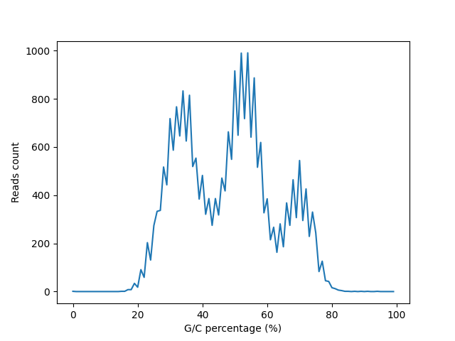

---
title: 3 laboratorinis darbas
author: Armintas Pakenis
date: 2022-12-01
affiliation: Vilniaus universitetas
email: armintas.pakenis@mif.stud.vu.lt
abstract: Naujos kartos sekoskaitos duomenų analizė
lang: lt
colorlinks: true
...

# Įžanga

Visi failai ir script'ai, susiję su užduotimi, pateikiami [čia](https://github.com/ArmintasP/Bioinf/tree/main/Lab3).

# 1 užduotis

FASTQ, kaip ir FAST, yra tekstinis formatas, saugantis informaciją apie baltymų ar nukleobazių seką. Priešingai nei FAST, FASTQ formatu bandyta išspręsti variruojančių tikimybių  problemą identifikuojant nukleobazes (nes sekvescionavimo metodai būna skirtingi). FASTQ formatas turi informaciją apie sekos kokybę. Kokybei užrašyti gali būt naudojamos įvairios koduotės, pvz. Phread quality score.

`Sequence id` prasideda su `@` (priešingai nuo FAST `>`), nurodomas sekos id ir kiti svarbūs duomenys (projekto pavadinimas, sekos pozicija, ir t. t.). Sekančioje eilutėje pateikiama nuskaityta seka. Kitoje eilutėje būna `+` ženklas. Ir galiausiai, naujoje eilutėje pateikiama sekos kokybės informacija pagal tam tikrą koduotę.

# 2 užduotis

23 + 33 = 56, tai būtų simbolis '8'.

# 3 užduotis

Pirmi 32 ASCII simboliai yra nespausdinamieji rezervuoti simboliai (control codes), kurie naudojami intencijai, o ne atvaizdavimui, nusakyti.

# 4 užduotis

## a dalis

Koduotė yra arba Phred+33, arba Illumina1.8+Phred+33. Script'o kodas patiektas repozitorijoje, naudojantis trivialiais patikrinimais (tikrinant ar patenka ascii kodas į tam tikrus rėžius). Gauta, kad patenka tiek į Phred+33, tiek į Illumina1.8 rėžius. Kitaip tariant, kokybės simboliai patenka į ASCII 33-73 simbolių aibę.

## b dalis

Diagramoje matyti 3 pikai.

## c dalis

Pirmos 5 eilutės - pirmojo piko, sekančios 5 eilutės - antrojo piko, paskutinės 5 - trečiojo piko.

| ID                                           | Found match                                                        |
|----------------------------------------------|--------------------------------------------------------------------|
| M00827:12:000000000-AEUNW:1:1101:12898:3746  | Staphylococcus aureus strain JDFM SA01 chromosome, complete genome |
| M00827:12:000000000-AEUNW:1:1101:15734:4405  | Staphylococcus aureus strain DSM 20231 chromosome, complete genome |
| M00827:12:000000000-AEUNW:1:1101:14559:5316  | Staphylococcus aureus strain DSM 20231 chromosome, complete genome |
| M00827:12:000000000-AEUNW:1:1101:10754:8831  | Staphylococcus aureus strain DSM 20231 chromosome, complete genome |
| M00827:12:000000000-AEUNW:1:1101:21560:11525 | Staphylococcus aureus strain JDFM SA01 chromosome, complete genome |
| M00827:12:000000000-AEUNW:1:1101:14568:2958  | Escherichia coli strain HUM3355 chromosome, complete genome        |
| M00827:12:000000000-AEUNW:1:1101:11742:3950  | Escherichia coli strain HUM3355 chromosome, complete genome        |
| M00827:12:000000000-AEUNW:1:1101:9837:4027   | Escherichia coli EC20-4B-2 DNA, complete genome                    |
| M00827:12:000000000-AEUNW:1:1101:12227:4848  | Escherichia coli strain HeN100 chromosome, complete genome         |
| M00827:12:000000000-AEUNW:1:1101:18054:6383  | Escherichia coli strain XYEH3783 chromosome, complete genome       |
| M00827:12:000000000-AEUNW:1:1101:18070:3392  | Thermus thermophilus strain N-1 chromosome, complete genome        |
| M00827:12:000000000-AEUNW:1:1101:23350:4251  | Thermus thermophilus strain N-1 chromosome, complete genome        |
| M00827:12:000000000-AEUNW:1:1101:23294:5998  | Thermus thermophilus strain N-1 chromosome, complete genome        |
| M00827:12:000000000-AEUNW:1:1101:12169:8149  | Thermus thermophilus SNM6-6 DNA, complete genome                   |
| M00827:12:000000000-AEUNW:1:1101:7922:8647   | Thermus thermophilus strain N-1 chromosome, complete genome        |

# 5 užduotis

Iš lentelės matyti trys dominuojančios bakterijos:

* Staphylococcus aureus
* Escherichia coli
* Thermus thermophilus